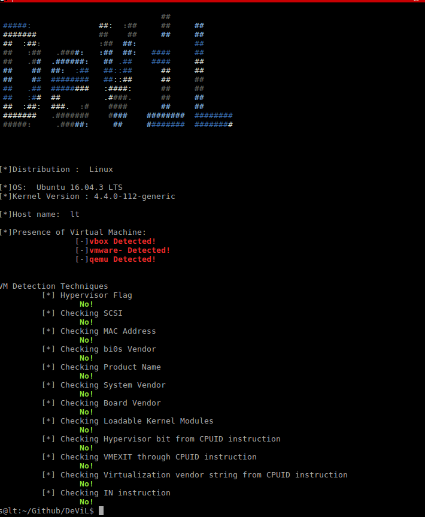

# DeViL
## Detect Virtual Machine in Linux
DeViL (Detect Virtual Machine in Linux) is a demonstration tool that employs several techniques to analyse the environment the same way a Linux malware would to detect if it is a virtual machine. The tool is built on File based and Instruction based Anti-VM techniques. It is implemented in python and C. The tool helps us show how the current VM configuration exposes itself to a malware  without running any malicious software on it. 

#### How to use:

$ ./DeViL.sh 

### SCREENSHOTS:

# Author

Sreelakshmi (@srlkhmi)(https://twitter.com/#!/srlkhmi)
 
